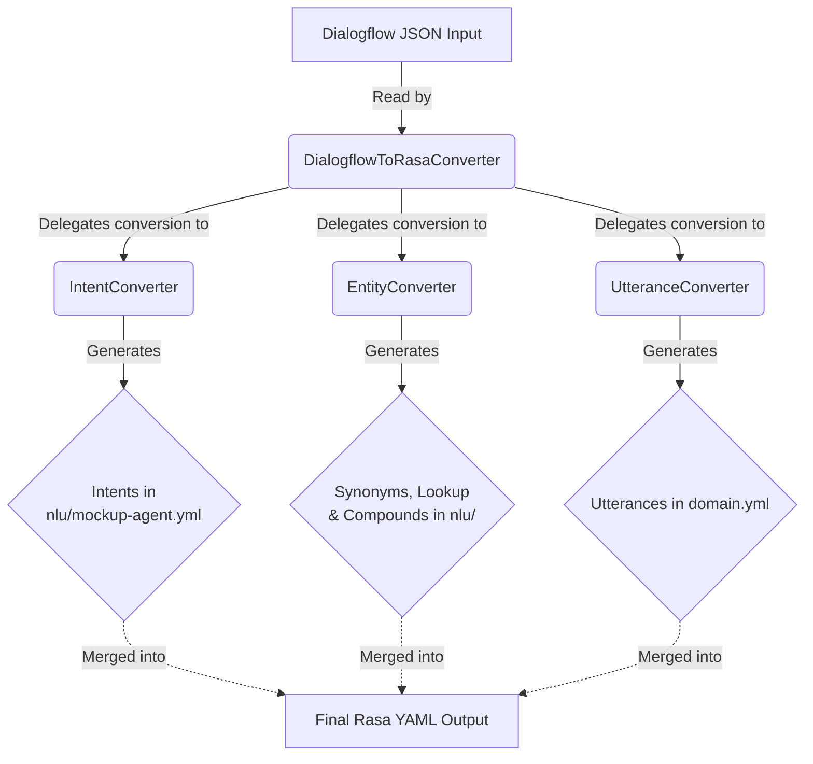

## Conversion Process Overview

The following diagram illustrates the process flow for converting Dialogflow JSON into Rasa YAML format using the `DialogflowToRasaConverter` tool. Each converter component (`IntentConverter`, `EntityConverter`, `UtteranceConverter`) is responsible for translating a specific part of the Dialogflow structure into the corresponding Rasa format, which is then merged to create the final Rasa-compatible YAML output.

